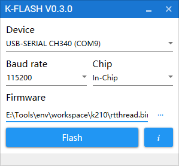

# RT-AK K210 Lab3: Mnist

## 实验简介

本实验是基于 Tensorflow 训练第一个 AI 模型：MNIST 手写数字识别模型。

MNIST 手写数字识别模型的主要任务是：

输入一张手写数字的图像，然后识别图像中手写的是哪个数字。

该模型的目标明确、任务简单，数据集规范、统一，数据量大小适中，在普通的PC电脑上都能训练和识别，堪称是深度学习领域的“Hello World!”，学习嵌入式AI的入门必备模型。


## 文件说明

```shell
LAB1-MNIST
|   lab1_mnist_training.ipynb		                # 神经网络模型训练代码
|   readme.md						# 实验说明
|
+---Applications					# 项目工程的应用代码，包含模型文件和推理文件
|   \---test_data					# 嵌入式 AI 模型推理所需要用到的图片数据
|
+---Datasets
|   +---quantize_data				        # 神经网络模型部署（量化）所需要用到的数据集
|   \---train_data					# 神经网络模型训练所需要用到的数据集
|
+---Firmwares						# 编译成功的固件，可直接烧录
+---Images					        # 存放文档中的图片
+---Models						# 神经网络模型文件
+---Utils						# 其他一些脚本文件
\---课后拓展						# 课后拓展的代码和固件
```

## 代码编译方法

把本实验将 `Applications` 文件夹下代码替换到Studio创建的模板工程的 applications 目录下的文件，然后在进行编译。

| 文件                | 描述                                                         |
| ------------------- | ------------------------------------------------------------ |
| test_data/          | 嵌入式AI模型得多个测试图片数据                               |
| img0_chw.h          | 模型推理得图片数据                                           |
| img0.h              | rgb565的显式数据                                             |
| main.c              | 包含了模型应用（推理）代码                                   |
| mnist_kmodel.c      | kmodel 的十六进制文件，使用 RT-AK 部署模型的时候会生成的文件，命名格式：<model_name>_kmodel.c |
| rt_ai_mnist_model.c | 目标平台相关信息文件。使用 RT-AK 部署模型的时候会生成的文件，命名格式：`rt_ai_<model_name>_kmodel.c` |
| rt_ai_mnist_model.h | 模型信息相关文件。使用 RT-AK 部署模型的时候会生成的文件，命名格式：`rt_ai_<model_name>_kmodel.h` |

**烧录**

连接好串口，然后使用 K-Flash 工具进行烧写bin文件。



---

其中，正常实验可以使用不带LCD驱动的SDK，

课后拓展的代码请使用带LCD驱动的SDK，编译方式与上面相同。
