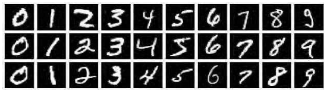

# Mnist

## 实验简介

本实验是基于 Tensorflow 训练第一个 AI 模型：MNIST 手写数字识别模型。

MNIST 手写数字识别模型的主要任务是：

输入一张手写数字的图像，然后识别图像中手写的是哪个数字。

该模型的目标明确、任务简单，数据集规范、统一，数据量大小适中，在普通的PC电脑上都能训练和识别，堪称是深度学习领域的“Hello World!”，学习嵌入式AI的入门必备模型。



## 文件说明

```shell
LAB1-MNIST
|   lab1_mnist_training.ipynb		                # 神经网络模型训练代码
|   readme.md						# 实验说明
|
+---Applications					# 项目工程的应用代码，包含模型文件和推理文件
|   \---test_data					# 嵌入式 AI 模型推理所需要用到的图片数据
|
+---Datasets
|   +---quantize_data				        # 神经网络模型部署（量化）所需要用到的数据集
|   \---train_data					# 神经网络模型训练所需要用到的数据集
|
+---Firmwares						# 编译成功的固件，可直接烧录
+---Images					        # 存放文档中的图片
+---Models						# 神经网络模型文件
+---Utils						# 其他一些脚本文件
\---课后拓展						# 课后拓展的代码和固件
```
